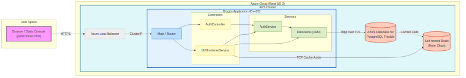
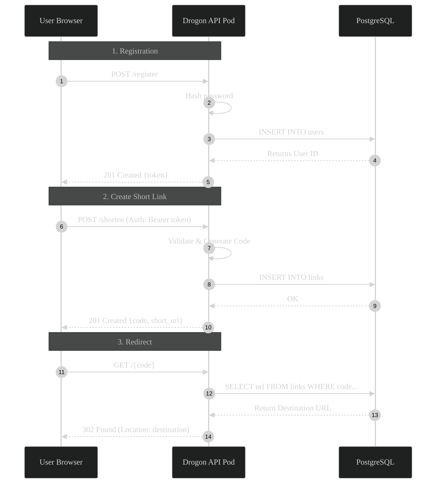

# URL Shortener Service

Production-ready **Java Spring Boot** service that issues short URLs behind authenticated APIs, persists data in PostgreSQL, and ships with a polished HTML dashboard plus automated smoke tests.

- **Live demo**: https://urlshortener-demo.westus3.cloudapp.azure.com
- **Latest deploy**: AKS cluster `aks-urlshortener` in `rg-urlshortener-wus3` (Azure West US 3)
- **Status**: ✅ Stable — backend, UI, and automated tests are all green (see `scripts/api_test_suite.py`).

## Highlights

- **Secure auth** – Registration/login APIs issue JWT bearer tokens; Spring Security filters enforce protected routes.
- **PostgreSQL storage** – Self-hosted PostgreSQL (Helm) running in-cluster for a fully self-contained deployment.
- **Redis Caching** – High-performance URL resolution using the Cache-Aside pattern to minimize database load.
- **Modern UI** – `public/index.html` now offers a login-first console with gated navigation, instant validation, and link management tools.
- **Automated validation** – Python test suite hits every auth + shorten + redirect endpoint locally or against prod via `BASE_URL`.
- **Cloud deployment** – Single command (`k8s/deploy-aks.sh`) builds the container, pushes to Azure Container Registry, and rolls out to AKS with external Postgres wiring.

## Architecture Overview




## Quick Start

```bash
# Build with Maven
./mvnw clean package

# Provide Postgres connection
export SPRING_DATASOURCE_URL='jdbc:postgresql://host:5432/urlshortener'
export SPRING_DATASOURCE_USERNAME='user'
export SPRING_DATASOURCE_PASSWORD='password'

# Provide Redis connection (optional, defaults to localhost)
export REDIS_HOST=127.0.0.1

# Run Spring Boot application
java -jar target/urlshortener-0.0.1-SNAPSHOT.jar

# Open UI
xdg-open http://localhost:9090/
```

### Configuration

`application.properties` + environment variables drive runtime behavior:

| Setting | Description |
| --- | --- |
| `SPRING_DATASOURCE_URL` | Required. JDBC URL for Postgres. |
| `REDIS_HOST` | Optional. Redis hostname (defaults to `localhost`). |
| `REDIS_PORT` | Optional. Redis port (defaults to `6379`). |
| `REDIS_PASSWORD` | Optional. Redis password. |
| `APP_BASE_URL` | Optional. Overrides host used when echoing `short` links (defaults to detected origin). |
| `JWT_SECRET`, `JWT_TTL_SECONDS` | JWT signing secret + lifetime. |

## Using the APIs

All endpoints return JSON unless noted.

| Method | Path | Notes |
| --- | --- | --- |
| POST | `/api/v1/register` | `{"name","email","password"}` → `{ user_id, name, email, token }` |
| POST | `/api/v1/login` | Issues a fresh token for `{ "email","password" }` |
| POST | `/api/v1/shorten` | Auth required (`Authorization: Bearer <token>`). Body: `{ "url", "ttl"? }` |
| GET | `/api/v1/urls` | Auth required. Lists caller’s links with timestamps + expiry. |
| GET | `/api/v1/info/{code}` | Public metadata for any code. |
| GET | `/{code}` | Redirects to the stored destination. |
| GET | `/api/v1/health` | Health probe (checks DB connectivity). |

Register/login responses include a JWT bearer token; send it via `Authorization: Bearer <token>` on authenticated routes.

### API Sequence Example (register → shorten → redirect)




```bash
TOKEN=$(curl -s -X POST http://localhost:9090/api/v1/register \
  -H 'Content-Type: application/json' \
  -d '{"name":"Demo","email":"demo@example.com","password":"SecretPwd1"}' | jq -r '.token')

curl -s -X POST http://localhost:9090/api/v1/shorten \
  -H "Authorization: Bearer ${TOKEN}" \
  -H 'Content-Type: application/json' \
  -d '{"url":"https://example.com","ttl":600}'

curl -s -H "Authorization: Bearer ${TOKEN}" http://localhost:9090/api/v1/urls
```

## Testing

```
python3 -m venv .venv && source .venv/bin/activate
pip install -r scripts/requirements.txt

# Local server
BASE_URL=http://localhost:9090 python scripts/api_test_suite.py

# Against prod (AKS)
BASE_URL=http://4.249.87.222 python scripts/api_test_suite.py
```

The suite performs health → register/login → shorten/list/info/redirect checks and fails fast on regressions.

## Deployment

```
bash k8s/deploy-aks.sh
```

What the script does:

1. Ensures Azure resource group, AKS cluster, and ACR (Basic SKU) exist.
2. Installs **Redis** and **PostgreSQL** via Helm charts into the cluster.
3. Builds the Docker image using the repo’s multi-stage Dockerfile.
4. Pushes to ACR and wires AKS with `external-postgres` secret pointing to the in-cluster Postgres.
5. Applies `k8s/deployment.yaml` + `k8s/service.yaml`, waits for rollout, and prints the LoadBalancer endpoint.

### Pulling secrets from Azure Key Vault

(Optional) If you still want to use an external Azure Postgres, you can provide the connection string via Key Vault:

```bash
az keyvault create -n kv-urlshortener -g rg-urlshortener-wus3 -l westus3
az keyvault secret set -n pg-urlshortener -o tsv \
  --vault-name kv-urlshortener \
  --value 'jdbc:postgresql://pg-urlshortener.postgres.database.azure.com:5432/urlshortener?sslmode=require&user=user&password=pass'

KEYVAULT_NAME=kv-urlshortener KV_SECRET_NAME=pg-urlshortener \
  bash k8s/deploy-aks.sh
```

`SPRING_DATASOURCE_URL` is still honored if exported, and `CREATE_PG=true` can provision a dev Postgres automatically. If neither applies, providing `KEYVAULT_NAME` + `KV_SECRET_NAME` is the preferred secure path.

Re-run the Python smoke suite pointing at the returned hostname or the friendly DNS (`urlshortener-demo.westus3.cloudapp.azure.com`).

## Repository Layout

| Path | Purpose |
| --- | --- |
| `src/main/java` | Spring Boot application source code. |
| `src/main/resources` | Configuration and static assets. |
| `legacy_cpp/` | Archived C++ implementation. |
| `k8s/` | Deployment + service manifests and AKS helper script. |
| `scripts/api_test_suite.py` | End-to-end verification suite. |

## License

MIT – see `LICENSE`.
